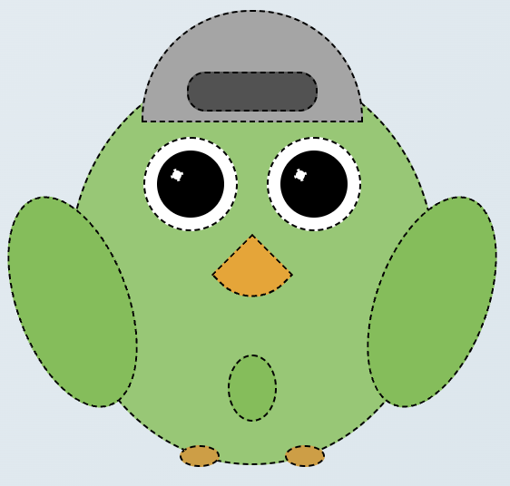

# CSS Owl Project

## Overview

This repository is a toy project designed for pedagogic purposes as a brief introduction to CSS. Participants will create a minimalistic owl using basic geometric shapes and common CSS properties, making this a fun and interactive way to learn CSS fundamentals.



## Purpose

The CSS Owl Project aims to introduce beginners to key CSS concepts through a hands-on approach. By working on this project, participants will learn:

- How to style HTML elements using CSS.
- Common CSS properties such as `border`, `background`, `position`, and `transform`.
- Basic layout techniques and positioning in CSS.
- Collaborative coding and version control using Git.

## How to Use This Repository

Each participant will work on a separate Git branch, making changes that will ultimately be merged to form a complete owl illustration.

### Getting Started

1. **Clone the Repository:**
   ```bash
   git clone https://github.com/ramonAtDuo/apjc_owl.git
   cd apjc_owl
2. **Create and Switch to Your Branch:**
   ```bash
   git checkout -b your-branch-name
3. **Start Coding:**
- Modify the main CSS file (styles.css) to complete your assigned part of the owl.
- Follow the project rules and guidelines to ensure consistency.
4. **Commit and Push Your Changes:**
    ```bash
    git add .
    git commit -m "Add [your feature or changes]"
    git push origin your-branch-name
5. **Submit a Pull Request:**
- Open a pull request to merge your branch into 'result' branch once your changes are finalized.

### Contributing
Welcome contributors! If you have ideas for enhancements or new features, feel free to open an issue or submit a pull request.

### License
This project is licensed under the MIT License, making it free to use, modify, and distribute.